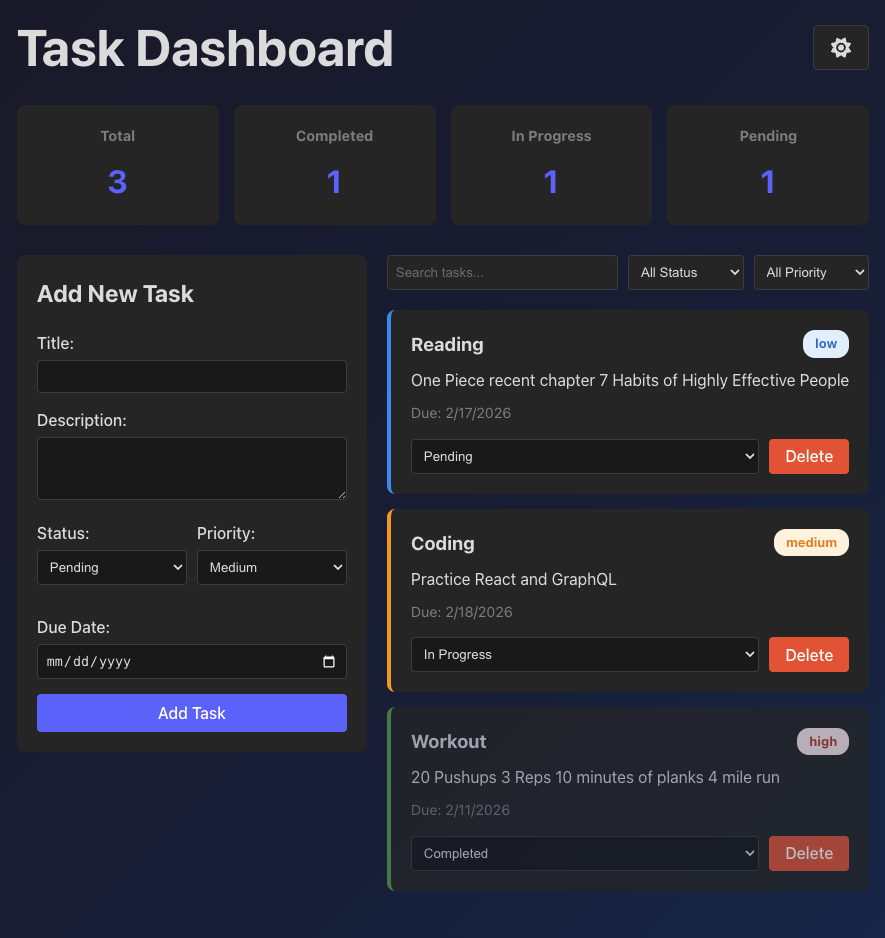
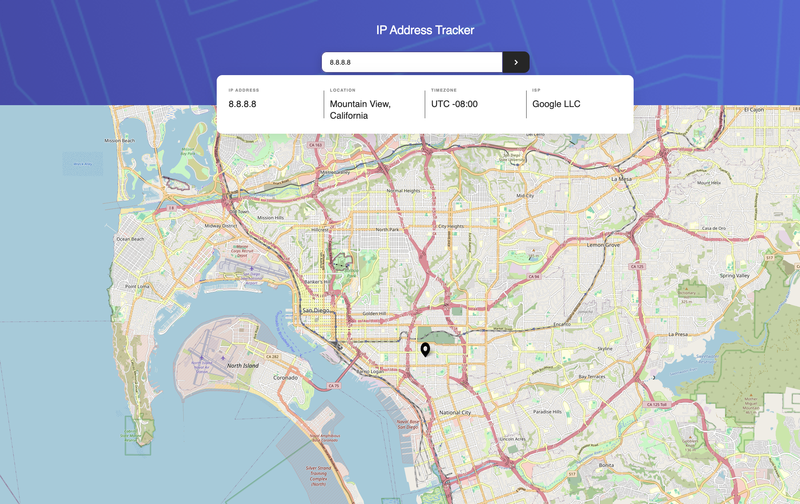
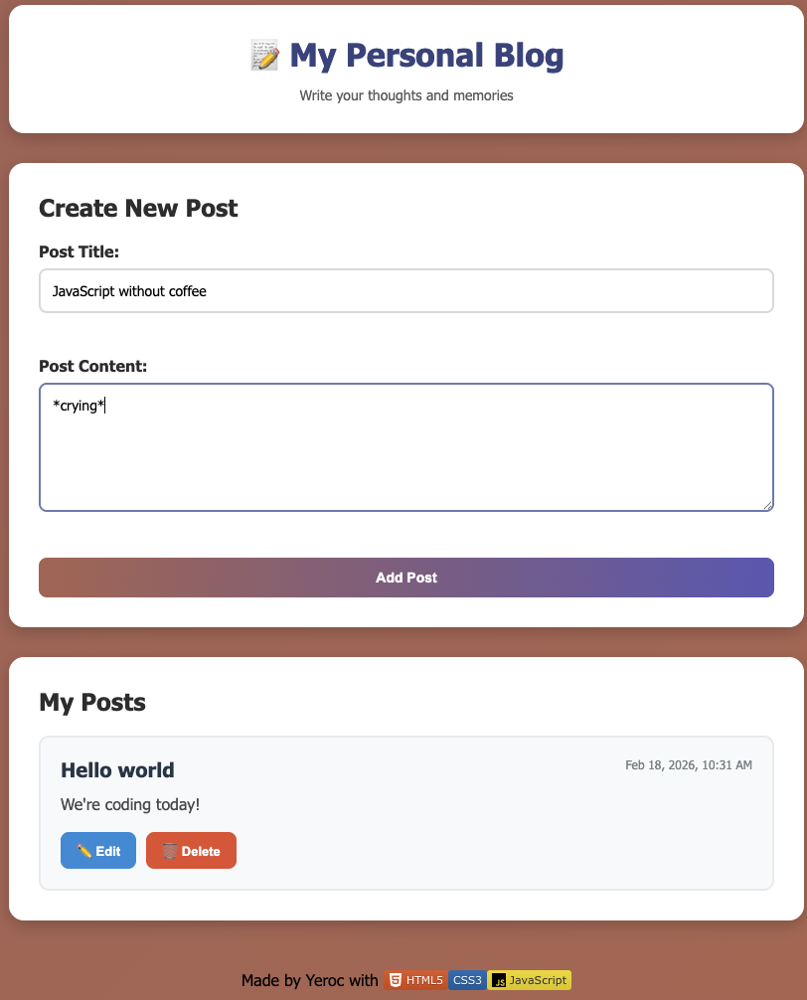

# Desktop Portfolio OS

Interactive desktop-style portfolio built with React and Vite. The app simulates an operating system UI with desktop icons, draggable windows, taskbar controls, and personalization settings.

## Live Demo

- [Desktop Portfolio OS](https://corey-portfolio-henna.vercel.app/)

## Screenshot


## React Taskboard Screenshot



## IP Address Tracker Screenshot



## Personal Blog Platform Screenshot



## Core Features

- Boot screen intro sequence
- Draggable and resizable desktop windows
- Minimize, maximize, close, and focus window states
- Desktop context menu and start menu interactions
- Theme customization (light/dark, accent color, wallpapers)
- Mobile-specific UX behavior for window management

## Stack

- React
- Vite
- react-draggable
- CSS (custom properties + component styling)

## Run Locally

```bash
npm install
npm run dev
```
